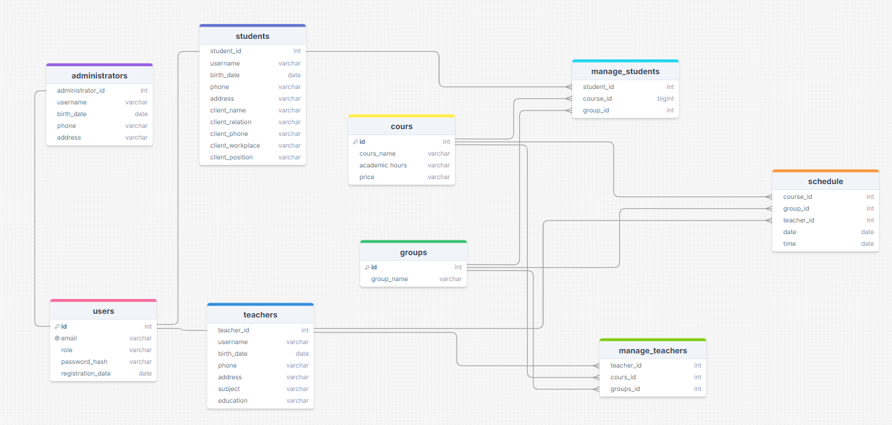

# 🚀 **CRM Application**

**CRM-приложение** — это веб-приложение, предназначенное для управления взаимоотношениями между администрацией, преподавателями и студентами. 

---

## 🗂️ **Содержание**
- [Функционал](#функционал)
- [Технологии](#технологии)
- [Установка и запуск](#установка-и-запуск)
- [Использование](#использование)
- [Структура проекта](#структура-проекта)

---

## 🎯 **Функционал**
- 🔒 **Авторизация и аутентификация**: Пользователи входят в систему с проверкой ролей (Администратор, Учитель, Студент).
- 🛠️ **Управление данными**: Администратор может управлять данными через панель управления.

---

## 🛠️ **Технологии**
- **Backend**: Flask, SQLAlchemy, Flask-Login, Flask-WTF
- **Frontend**: HTML/CSS
- **Шаблоны**: Jinja2
- **База данных**: SQLite
- **Дополнительно**: Flask-Migrate для управления миграциями

---

## 💻 **Установка**
### **1. Клонирование репозитория**
```bash
git clone https://github.com/nagima-99/crm-final.git
cd crm-final
```

### **2. Установка зависимостей**
```bash
python -m venv venv
venv\Scripts\activate
pip install -r requirements.txt
```

### **3. Настройка базы данных**
```bash
flask db init
flask db migrate -m "initial migration"
flask db upgrade
```

### **4. Запуск**
```bash
flask run
python app.py
```

---

## 📖 **Использование**
1. учетные данные: 
   - **Администратор**:
        Логин: admin@gmail.com
        Пароль: 12345678
   - **Учитель**: 
        Логин: teacher@gmail.com
        Пароль: 12345678
   - **Студент**: 
        Логин: student@gmail.com
        Пароль: 12345678

---

## 🗂️ **Схема базы данных**


---

## 📁 **Структура проекта**
```
├── app.py                  # Основной файл приложения
├── models.py               # Модели базы данных
├── forms.py                # Формы для валидации
├── templates/              # Шаблоны HTML
├── static/                 # Статические файлы
├── migrations/             # Миграции базы данных
├── requirements.txt        # Зависимости проекта
├── README.md               # Документация
```
